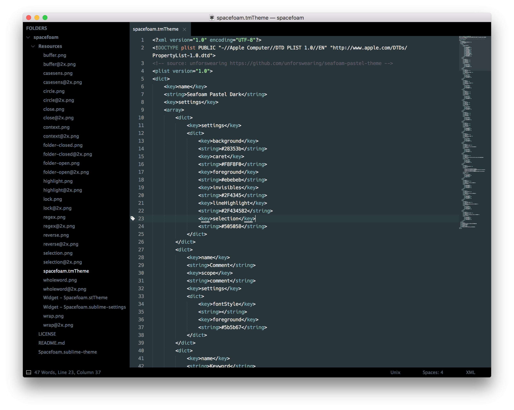

# Spacefoam

A modified [Spacegray](https://github.com/kkga/spacegray) theme. Simple black background and grey tabs with matching pastel-on-gray color scheme.



## Install

Download repo contents and place in a folder called `spacefoam` in Sublime Text's Packages directory (you can find its location by selecting `Sublime > Preferences > Browse Packages...` on macOS), or `git clone` directly into Packages, then activate by adding

```json
"theme": "Spacefoam.sublime-theme",
"color_scheme": "Packages/spacefoam/Resources/spacefoam.tmTheme"
```

to your Preferences.sublime-settings file.

This theme will be added to Package Contol in the future for easy access.